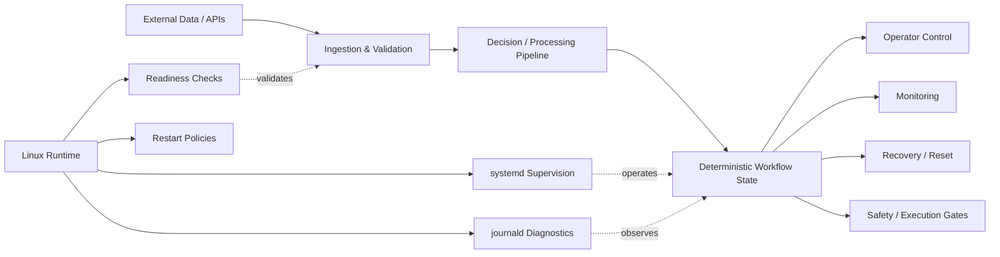

<div align="center">

# ExtremeViper

### Real-Time Automation, Reliability & Operations Platform

**Python · Linux · systemd · API Integration · Workflow Orchestration · Reliability Engineering**

[RebootAI](https://www.rebootai.link) · [GitHub Profile](https://github.com/irebootai)

</div>

---

## Engineering Context

ExtremeViper is a long-running engineering initiative focused on designing and operating a real-time automation platform under external-data, state-management, service-reliability, and human-control constraints.

The domain is market-data driven, but the engineering work is broader: ingest external data, validate freshness and eligibility, coordinate stateful workflows, isolate failures, supervise Linux services, expose operational controls, and keep high-impact actions behind deliberate safety boundaries.

This public repository documents the architecture, operating model, reliability controls, and selected public-safe implementation patterns. Private implementation details, credentials, production-specific configuration, and sensitive operational artifacts remain outside the public repository.

## System Scope

The platform combines real-time processing with production-style operating controls:

- **Real-time automation** with an immediate first scan and one-second scanning cadence during active workflows.
- **External API integration** for data ingestion, operator messaging, and separately gated execution paths.
- **Deterministic workflow orchestration** across discovery, confirmation, monitoring, exit, recovery, and reset states.
- **Human-in-the-loop control** at high-impact decision boundaries, including expiration and stale-response protection.
- **Linux service operation** with `systemd` supervision, readiness checks, restart behavior, environment isolation, and `journald` diagnostics.
- **Reliability safeguards** for stale data, duplicate events, overlapping work, delayed responses, dependency failures, and safe degraded operation.

## Engineering Ownership

The project reflects end-to-end ownership across architecture, automation, operations, reliability, and supportability:

- Designed modular boundaries across data ingestion, validation, workflow orchestration, operator control, monitoring, and execution paths.
- Operated the application as a supervised Linux service using `systemd`, restart behavior, readiness checks, and `journald` diagnostics.
- Integrated external APIs while accounting for stale data, transport failures, duplicate events, dependency boundaries, and safe degradation.
- Implemented deterministic lifecycle handling so state transitions remain explicit, observable, and resistant to stale or conflicting actions.
- Built safety controls including freshness gates, deduplication, overlap protection, human confirmation, and execution disabled by default.
- Established operational procedures for service status, troubleshooting, restart, failure recovery, and incident-style diagnosis.
- Maintained a deliberate boundary between public technical evidence and private implementation/configuration.

## Architecture



The architecture is intentionally separated by responsibility so data concerns, workflow state, operator interaction, monitoring, and execution boundaries can be reasoned about independently.

## Design Decisions & Tradeoffs

### Explicit state over implicit workflow behavior

Real-time systems become difficult to troubleshoot when behavior depends on hidden context. ExtremeViper uses explicit lifecycle state so the active workflow stage can be inspected, validated, and controlled.

**Tradeoff:** more state-management code in exchange for clearer failure analysis and safer transitions.

### Execution isolated from analysis

Data processing and decision logic do not depend on live execution being enabled. This allows the system to operate in decision-support and shadow modes while keeping higher-risk actions behind a separate boundary.

**Tradeoff:** additional integration boundaries in exchange for safer testing and reduced coupling.

### Stale and duplicate events rejected

Old responses, repeated callbacks, overlapping scans, or late transport events must not mutate the current workflow.

**Tradeoff:** stricter validation and request correlation in exchange for deterministic behavior under asynchronous conditions.

### Human control at high-impact boundaries

Sensitive actions remain confirmation-gated rather than being treated as implicitly approved.

**Tradeoff:** lower automation autonomy in exchange for operational safety and auditability.

### Supervised Linux service operation

The application is managed as a service rather than as an ad hoc script.

**Tradeoff:** additional operational configuration in exchange for restart behavior, startup consistency, service inspection, and centralized diagnostics.

## Reliability Engineering

Reliability controls are treated as core design requirements rather than afterthoughts:

- Deterministic lifecycle transitions
- Data freshness validation
- Stale-event rejection
- Duplicate-event suppression
- Overlap protection for active workflows
- Safe defaults for invalid or unavailable inputs
- Explicit readiness behavior
- Human confirmation for sensitive actions
- Execution disabled by default unless independently enabled and validated
- Operational logging and service diagnostics

## Operational Evidence

The project is operated as a service, not just executed as a script. Day-to-day operating and troubleshooting patterns include:

```bash
sudo systemctl status extremeviper.service
sudo systemctl restart extremeviper.service
sudo journalctl -u extremeviper.service -f
```

Operational work includes:

- Verifying service health and runtime state.
- Reviewing `journald` output to isolate application, API, transport, or configuration failures.
- Validating environment readiness before startup.
- Detecting stale, duplicate, or overlapping workflow conditions.
- Restarting services safely and confirming recovery to a known lifecycle state.
- Keeping decision-support and shadow workflows available independently of higher-risk execution paths.

This operational layer is a core part of the engineering work: build the automation, run it, observe it, troubleshoot it, and recover it predictably.

## Technology & Practices

| Engineering Area | Technologies / Practices |
|---|---|
| Language | Python 3.12 |
| Runtime | Linux |
| Service management | systemd |
| Diagnostics | journald |
| External integrations | REST APIs, Telegram Bot API, data-provider and broker adapters |
| Architecture | Modular components, adapters, controllers, deterministic state machine |
| Reliability | Freshness gates, deduplication, stale-event rejection, overlap protection, safe defaults |
| DevOps | Git, GitHub, environment hygiene, deployment documentation, operational runbooks |
| Operations | Service supervision, status inspection, recovery, failure isolation, troubleshooting |

## Failure Modes Considered

The system is designed around practical operational questions:

- What happens when incoming data is stale or unavailable?
- What if an external API responds late or fails?
- What if an operator responds to an expired request?
- What if the same action is received twice?
- What if a scan starts while another workflow is active?
- What happens after a service restart?
- Can a transport failure be mistaken for approval?
- Can the system continue safely when execution is unavailable?

These failure modes drive the architecture, validation rules, lifecycle design, and operating procedures.

## Engineering Outcomes

ExtremeViper takes a real-time automation system beyond basic scripting and applies production-style operational discipline:

- External dependencies are validated rather than blindly trusted.
- Workflow state is explicit rather than implicit.
- Failure conditions are handled as first-class system behavior.
- Services are supervised and diagnosable on Linux.
- Recovery paths are documented and operationally usable.
- High-impact actions remain separated behind deliberate safety boundaries.
- The system can continue operating in reduced-risk modes when execution is disabled.

The resulting engineering patterns are directly applicable to Cloud Operations, DevOps, Platform Engineering, Site Reliability Engineering, Infrastructure Automation, and Operations Support environments.

## Public Repository Boundary

This repository exposes selected public-safe code, configuration examples, and technical documentation for external review. It is intentionally not a complete mirror of the private engineering repository.

Sensitive configuration, credentials, private implementation details, production-specific information, and internal operational artifacts remain private by design.

## RebootAI

ExtremeViper is part of the RebootAI engineering portfolio.

**RebootAI focuses on platform engineering, cloud operations, automation, observability, reliability, and AI-assisted workflows.**

<div align="center">

[Visit RebootAI](https://www.rebootai.link) · [GitHub Profile](https://github.com/irebootai)

</div>
